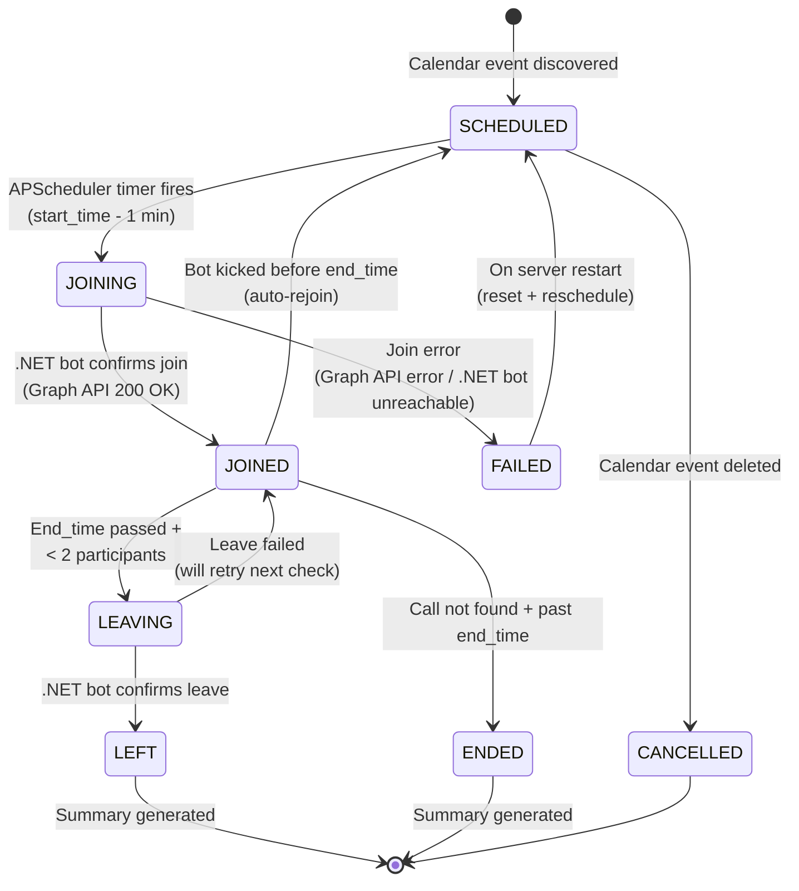
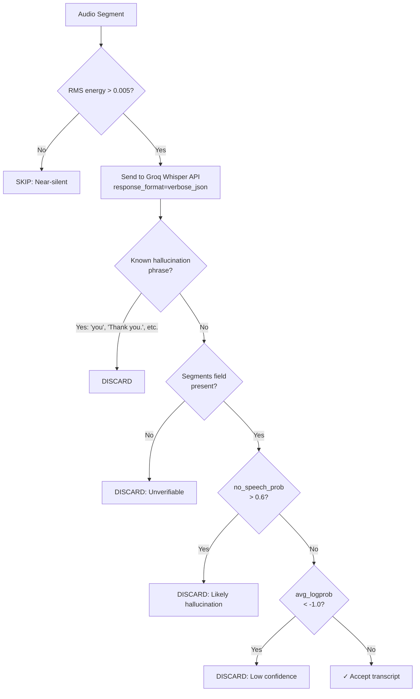
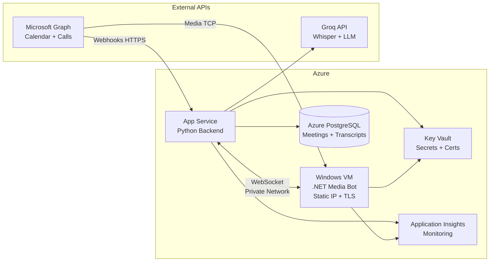

# Meeting Assistant Bot — Complete Implementation Documentation

## Table of Contents
1. [Project Overview](#1-project-overview)
2. [Architecture Overview](#2-architecture-overview)
3. [System Flow Diagram](#3-system-flow-diagram)
4. [Detailed Component Breakdown](#4-detailed-component-breakdown)
5. [End-to-End Execution Flow](#5-end-to-end-execution-flow)
6. [WebSocket Audio Protocol](#6-websocket-audio-protocol)
7. [Voice Activity Detection (VAD)](#7-voice-activity-detection-vad)
8. [Speech-to-Text Pipeline](#8-speech-to-text-pipeline)
9. [Meeting Summary Generation](#9-meeting-summary-generation)
10. [Data Storage & Output](#10-data-storage--output)
11. [Configuration & Environment](#11-configuration--environment)
12. [POC Infrastructure (Current)](#12-poc-infrastructure-current)
13. [Production Infrastructure & Implementation](#13-production-infrastructure--implementation)

---

## 1. Project Overview

The **Meeting Assistant Bot** is an AI-powered Microsoft Teams meeting bot that:
- **Automatically joins** scheduled Teams meetings from a monitored calendar
- **Captures per-speaker unmixed audio** (no diarization needed — Teams separates speakers)
- **Transcribes speech in real-time** using Groq Whisper (with alternatives: NVIDIA Parakeet, Qwen3-ASR)
- **Tracks participant** join/leave/rejoin sessions
- **Generates structured meeting summaries** (summary, action items, key decisions) using an LLM after the meeting ends

### Why Two Processes?

The bot uses a **two-process architecture**:
- **Python Backend** (FastAPI) — Calendar integration, scheduling, ML/STT, LLM, orchestration
- **.NET Media Bot** (ASP.NET Core) — Teams Media SDK (Windows-only), raw audio capture

The Teams Media SDK (`Microsoft.Skype.Bots.Media`) is a Windows-only .NET library that provides direct access to per-speaker unmixed audio streams. Python handles everything else. The two communicate via a **local WebSocket** carrying raw PCM audio frames.

---

## 2. Architecture Overview

```
┌─────────────────────────────────────────────────────────────────────────┐
│                        Microsoft Teams Cloud                             │
│                                                                         │
│   ┌─────────────────┐    ┌──────────────────┐    ┌─────────────────┐  │
│   │ Outlook Calendar │    │  Teams Meeting   │    │  Graph API      │  │
│   │     Events       │    │   Audio Engine   │    │  (Participants) │  │
│   └────────┬─────────┘    └────────┬─────────┘    └────────┬────────┘  │
│            │                       │                        │           │
└────────────┼───────────────────────┼────────────────────────┼───────────┘
             │ HTTPS                 │ TCP                    │ HTTPS
             │ (Graph Webhooks)      │ (Raw Audio)            │ (REST)
             │                       │                        │
     ┌───────┼───────────────────────┼────────────────────────┼──────────┐
     │ ngrok │ HTTPS Tunnel          │ TCP Tunnel             │          │
     └───────┼───────────────────────┼────────────────────────┼──────────┘
             │                       │                        │
             ▼                       ▼                        │
┌──────────────────────────┐  ┌──────────────────────────────┐│
│  PYTHON BACKEND (:8000)  │  │  .NET MEDIA BOT (:9090/8445) ││
│                          │  │                              ││
│ ┌──────────────────────┐ │  │ ┌──────────────────────────┐ ││
│ │ Calendar Webhook     │ │  │ │ CallService              │ ││
│ │ Handler              │ │  │ │ - Graph join/leave       │◄┘
│ └──────────┬───────────┘ │  │ │ - Media Platform init    │ │
│            │             │  │ └──────────┬───────────────┘ │
│            ▼             │  │            │                 │
│ ┌──────────────────────┐ │  │            ▼                 │
│ │ Meeting Service      │ │  │ ┌──────────────────────────┐ │
│ │ + Scheduler          │─┼──┼►│ BotMediaStream           │ │
│ │ (APScheduler)        │ │  │ │ - AudioSocket recv       │ │
│ └──────────┬───────────┘ │  │ │ - Per-speaker buffers    │ │
│            │             │  │ └──────────┬───────────────┘ │
│            ▼             │  │            │                 │
│ ┌──────────────────────┐ │  │            ▼                 │
│ │ Leave Checker (60s)  │ │  │ ┌──────────────────────────┐ │
│ │ + Participant        │ │  │ │ ParticipantResolver      │ │
│ │   Tracker            │ │  │ │ - ActiveSpeakerId→Name   │ │
│ └──────────────────────┘ │  │ │ - Cross-tenant lookup    │ │
│                          │  │ └──────────┬───────────────┘ │
│ ┌──────────────────────┐ │  │            │                 │
│ │ WebSocket Server     │◄┼──┼────────────┘                 │
│ │ (:8765)              │ │  │ ┌──────────────────────────┐ │
│ │ Binary audio frames  │◄┼──┼─│ AudioForwarder           │ │
│ └──────────┬───────────┘ │  │ │ - WebSocket client       │ │
│            │             │  │ │ - Auto-reconnect         │ │
│            ▼             │  │ └──────────────────────────┘ │
│ ┌──────────────────────┐ │  └──────────────────────────────┘
│ │ Silero VAD           │ │
│ │ (per-speaker slot)   │ │
│ └──────────┬───────────┘ │
│            │             │
│            ▼             │
│ ┌──────────────────────┐ │        ┌─────────────────────┐
│ │ STT Provider         │─┼───────►│ Groq Whisper API    │
│ │ (Groq/NVIDIA/Qwen)   │ │        │ (whisper-large-v3)  │
│ └──────────┬───────────┘ │        └─────────────────────┘
│            │             │
│            ▼             │
│ ┌──────────────────────┐ │
│ │ Transcript Store     │ │
│ │ (real-time file      │ │
│ │  writes per meeting) │ │
│ └──────────┬───────────┘ │
│            │             │
│            ▼             │
│ ┌──────────────────────┐ │        ┌─────────────────────┐
│ │ Meeting Summary      │─┼───────►│ Groq LLM API        │
│ │ (on meeting end)     │ │        │ (llama-3.3-70b)     │
│ └──────────────────────┘ │        └─────────────────────┘
└──────────────────────────┘
```

---

## 3. System Flow Diagram

### Complete End-to-End Flow (Mermaid)

```mermaid
flowchart TD
    %% Calendar Discovery
    A[📅 Calendar Event Created<br/>in Outlook/Teams] -->|Graph Change Notification| B[Python: Calendar Webhook Handler]
    B --> C{Event has<br/>Teams Join URL?}
    C -->|No| D[Ignore event]
    C -->|Yes| E[Meeting Service:<br/>Register meeting in JSON store]
    E --> F[APScheduler:<br/>Schedule join at start_time - 1 min]

    %% Meeting Join
    F -->|Timer fires| G[Python: POST /bot/join<br/>to .NET bot]
    G --> H[.NET: CallService.JoinMeetingAsync]
    H --> I[Initialize Media Platform<br/>TLS cert + ngrok TCP endpoint]
    I --> J[Create AudioSocket<br/>16kHz, Mono, Recvonly,<br/>ReceiveUnmixedMeetingAudio=true]
    J --> K[Connect WebSocket<br/>to Python ws://localhost:8765]
    K --> L[POST to Graph API<br/>/communications/calls<br/>with appHostedMediaConfig]
    L --> M[Bot appears in<br/>Teams meeting]

    %% Audio Streaming
    M --> N[Teams Media SDK:<br/>OnAudioReceived event<br/>every 20ms per speaker]
    N --> O[BotMediaStream:<br/>Extract UnmixedAudioBuffer<br/>+ ActiveSpeakerId]
    O --> P[ParticipantResolver:<br/>Map speakerId → display name]
    P --> Q[AudioForwarder:<br/>Build binary frame<br/>+ Send via WebSocket]

    %% Python Audio Processing
    Q --> R[Python WebSocket Server:<br/>Parse binary frame]
    R --> S[Silero VAD:<br/>Per-speaker-slot buffering]
    S --> T{Speech turn<br/>complete?}
    T -->|Silence 300ms| U[Complete segment]
    T -->|Speaker identity change| U
    T -->|Safety cap 12s| U
    T -->|Still speaking| S

    U --> V[Async Background Task:<br/>STT Transcription]
    V --> W[Groq Whisper API:<br/>verbose_json response]
    W --> X{Hallucination<br/>check passes?}
    X -->|Yes| Y[Transcript Store:<br/>Write to file with<br/>speaker + timestamp]
    X -->|No| Z[Discard segment]

    %% Meeting End
    AA[Leave Checker:<br/>Every 60 seconds] --> AB{Past end_time AND<br/><2 participants?}
    AB -->|No| AA
    AB -->|Yes| AC[Python: POST /bot/leave<br/>to .NET bot]
    AC --> AD[.NET: Disconnect WebSocket<br/>+ Delete Graph call]
    AD --> AE[Meeting Summary Service]
    AE --> AF[Read full transcript file]
    AF --> AG[Groq LLM:<br/>llama-3.3-70b-versatile]
    AG --> AH[Save summary file<br/>with action items +<br/>key decisions]
```



### Meeting Lifecycle State Machine



---

## 4. Detailed Component Breakdown

### 4.1 Python Backend Components

| File | Responsibility |
|------|---------------|
| `src/main.py` | FastAPI app entry point. Starts scheduler, WebSocket server, ngrok tunnel, Graph subscription |
| `src/settings.py` | All configuration from `.env` via pydantic-settings |
| `src/clients/graph_auth.py` | OAuth2 token acquisition (MSAL) |
| `src/clients/graph_calendar_client.py` | Graph calendar subscriptions + event fetching |
| `src/clients/graph_call_client.py` | Graph call join/leave/participants API |
| `src/clients/groq_stt_client.py` | Groq Whisper transcription with hallucination filtering |
| `src/clients/nvidia_stt_client.py` | NVIDIA Parakeet CTC (Riva NIM gRPC) |
| `src/clients/qwen_stt_client.py` | Qwen3-ASR local CPU transcription |
| `src/clients/qwen_remote_stt_client.py` | Qwen3-ASR remote GPU via vLLM + ngrok |
| `src/models/meeting.py` | Pydantic models: Meeting, ParticipantRecord, ParticipantSession |
| `src/repository/meeting_repository.py` | JSON file-backed CRUD with thread-safe locking |
| `src/routes/calendar_routes.py` | `POST /api/calendar/notifications` — Graph webhook |
| `src/routes/call_routes.py` | `POST /api/calls/notifications` — call state changes |
| `src/routes/meeting_routes.py` | `GET /api/meetings` — list all meetings |
| `src/services/subscription_service.py` | Graph subscription creation + renewal |
| `src/services/calendar_sync_service.py` | Event parsing + attendee extraction |
| `src/services/meeting_service.py` | Meeting lifecycle orchestration |
| `src/services/meeting_scheduler.py` | APScheduler: join triggers, leave checker, participant tracking |
| `src/services/audio_websocket_server.py` | WebSocket server receiving audio + dispatching VAD/STT |
| `src/services/simple_vad.py` | Silero VAD with identity-change-aware speaker segmentation |
| `src/services/transcript_store.py` | Immediate file-write transcript with timestamps |
| `src/services/participant_tracker.py` | Join/leave session tracking via Graph roster polling |
| `src/services/meeting_summary.py` | LLM summary generation on meeting end |

### 4.2 .NET Media Bot Components

| File | Responsibility |
|------|---------------|
| `Program.cs` | ASP.NET Core host, DI registration |
| `Controllers/BotController.cs` | `POST /bot/join` and `POST /bot/leave` endpoints |
| `Services/CallService.cs` | Graph join, Media Platform init, stale call detection |
| `Services/BotMediaStream.cs` | AudioSocket event handler, WAV recording, frame dispatch |
| `Services/AudioForwarder.cs` | WebSocket client to Python with auto-reconnect |
| `Services/ParticipantResolver.cs` | ActiveSpeakerId → display name (Graph roster + cross-tenant) |
| `Services/TokenService.cs` | MSAL token provider (own tenant + cross-tenant) |

---

## 5. End-to-End Execution Flow

### Phase 1: Startup Sequence

```
Terminal 1: python start_tcp_tunnel.py
  └─ Opens ngrok TCP tunnel (e.g., 0.tcp.in.ngrok.io:12345 → localhost:8445)
  └─ This carries Teams media audio traffic

Terminal 2: cd dotnet_bot && dotnet run
  └─ ASP.NET Core starts on http://0.0.0.0:9090
  └─ Registers DI singletons: TokenService, AudioForwarder, ParticipantResolver, CallService
  └─ Waits for join requests from Python

Terminal 3: python -m uvicorn src.main:app --port 8000
  └─ FastAPI starts
  └─ start_scheduler() → APScheduler runs, leave-checker job every 60s
  └─ start_audio_server() → WebSocket server on ws://0.0.0.0:8765
  └─ ngrok HTTPS tunnel → e.g., https://xxxx.ngrok-free.dev → localhost:8000
  └─ (3s delay) ensure_subscription() → Graph calendar webhook created
  └─ initial_calendar_sync() → Fetch next 24h of calendar events
  └─ For each event with a Teams join URL → register_meeting() → schedule_meeting()
```

### Phase 2: Calendar Event Discovery

```
1. User creates a Teams meeting on the monitored mailbox (ASSISTANT_MAILBOX)
2. Microsoft Graph sends a change notification to:
   POST https://xxxx.ngrok-free.dev/api/calendar/notifications
3. Python handler:
   a. Validates webhook (clientState check, responds to validation requests)
   b. Deduplicates (30s window — Graph often sends 2-3 webhooks per event)
   c. Fetches full event details from Graph (subject, start/end, join URL, attendees)
   d. Calls meeting_service.register_meeting()
4. Meeting registered in data/meetings.json with status=SCHEDULED
5. APScheduler job created: trigger _trigger_join at (start_time - 1 minute)
```

### Phase 3: Meeting Join

```
1. APScheduler fires _trigger_join(meeting_id) at (start_time - 1 min)
2. Status updated to JOINING
3. Python POSTs to http://localhost:9090/bot/join with:
   - meetingId, joinUrl, callbackUrl, mediaPublicIp, mediaPublicPort, attendees
4. .NET CallService:
   a. Checks for duplicate join (queries Graph if callId exists)
   b. EnsureMediaPlatform() — initializes Media SDK (once per process):
      - Loads TLS certificate (.pfx)
      - Resolves ServiceFqdn → IP via DNS
      - Sets public port from ngrok TCP tunnel
   c. Creates BotMediaStream:
      - AudioSocket with: Pcm16K, Recvonly, ReceiveUnmixedMeetingAudio=true
      - Opens WAV file for debugging (records first 10 seconds)
   d. Connects WebSocket to ws://localhost:8765/audio/{meetingId}
   e. Creates appHostedMediaConfig blob from AudioSocket
   f. POSTs to Graph /communications/calls with meeting info + media config
   g. Graph returns callId → stored in memory + sent back to Python
5. Python updates meeting: status=JOINED, call_id stored
6. Bot appears as a named participant in the Teams meeting
```

### Phase 4: Real-Time Audio Capture & Transcription

```
Every 20ms (50 frames/second per active speaker):

1. Teams Media SDK fires AudioMediaReceived event on BotMediaStream
2. For each UnmixedAudioBuffer:
   a. Extract: ActiveSpeakerId (slot index), raw PCM bytes (640 bytes = 20ms @ 16kHz)
   b. ParticipantResolver maps ActiveSpeakerId → display name
      - Fetches participant roster from Graph every 30s
      - Matches mediaStream.sourceId to user identity
      - Cross-tenant: creates separate MSAL app for target tenant
   c. AudioForwarder builds binary WebSocket frame:
      [36B speaker_id][2B name_len][N name_bytes][640B PCM audio]
   d. Sends frame via WebSocket (serialized via SemaphoreSlim)

3. Python WebSocket server receives frame:
   a. Parses: speaker_id, speaker_name, audio_bytes
   b. Converts int16 PCM → float32 normalized [-1,1]
   c. Routes to SpeakerBuffer for this slot (speaker_id)

4. Silero VAD processes audio in 512-sample (32ms) windows:
   a. If speech detected → starts buffering
   b. Turn ends on:
      - 300ms silence (VAD probability < 0.65)
      - Speaker name changes on this slot (identity-change split)
      - 12s safety cap (prevents runaway buffers if VAD misses a pause)
   c. Minimum speech duration: 700ms (shorter = likely noise, discarded)

5. Completed speech segment → async background transcription task:
   a. Energy pre-filter: if RMS < 0.005, skip (near-silent)
   b. Convert float32 → WAV bytes
   c. POST to Groq Whisper API (response_format=verbose_json)
   d. Hallucination check:
      - Reject if no_speech_prob > 0.6
      - Reject if avg_logprob < -1.0
      - Reject known phrases ("you", "Thank you.", etc.)
   e. If passes: write to transcript file with speaker label + timestamp
```

### Phase 5: Meeting End & Summary Generation

```
1. Leave Checker runs every 60 seconds:
   a. Fetches Graph participant roster
   b. Updates participant_tracker (join/leave sessions)
   c. If past end_time AND < 2 participants:
      - Status → LEAVING
      - POST /bot/leave to .NET bot
   d. If bot was kicked before end_time:
      - Status → SCHEDULED (will auto-rejoin)

2. .NET LeaveMeetingAsync:
   a. Disconnect WebSocket (graceful close)
   b. Dispose BotMediaStream (stops AudioSocket, finalizes WAV)
   c. DELETE /communications/calls/{callId} (Graph)
   d. Clear participant resolver cache

3. Python WebSocket connection closes:
   a. Flush remaining speaker buffers (transcribe any partial segments)
   b. Wait for all pending transcription tasks to complete
   c. Close transcript file

4. generate_meeting_summary(meeting_id):
   a. Read full transcript file
   b. Extract unique speakers from transcript
   c. Build prompt with meeting metadata + full transcript
   d. Call Groq LLM (llama-3.3-70b-versatile):
      - System: "You are a professional meeting assistant..."
      - User: transcript + instructions for summary/action items/decisions
      - temperature=0.3, max_tokens=2000
   e. Save to data/summary/{meeting_id}_summary.txt
```

---

## 6. WebSocket Audio Protocol

### Connection
- URL: `ws://localhost:8765/audio/{meeting_id}`
- Direction: .NET → Python (unidirectional audio data)
- Keepalive: Python pings every 30s (timeout 90s), .NET keepalive every 15s
- .NET runs a background receive loop to process server pings (without this, connection times out)

### Binary Frame Format

```
┌───────────────────────────────────────────────────────────────────┐
│ Offset │  Size      │ Field                                       │
├────────┼────────────┼─────────────────────────────────────────────┤
│ 0      │ 36 bytes   │ speaker_id (UTF-8, null-padded GUID string) │
│ 36     │ 2 bytes    │ speaker_name_length (uint16, little-endian) │
│ 38     │ N bytes    │ speaker_name (UTF-8)                        │
│ 38+N   │ remaining  │ PCM audio (16-bit signed int, 16kHz, mono)  │
└───────────────────────────────────────────────────────────────────┘

Typical frame size: ~697 bytes
  36 (id) + 2 (name_len) + 19 (avg name) + 640 (20ms audio) = 697
```

### Frame Rate
- **50 frames/second** per active speaker (one frame every 20ms)
- Each frame carries 640 bytes of audio = 320 samples = 20ms @ 16kHz

---

## 7. Voice Activity Detection (VAD)

### Technology: Silero VAD (Neural Network)

The system uses **Silero VAD** — a compact neural network model (~2MB) that processes audio in fixed 512-sample (32ms) windows.

### Per-Speaker-Slot Buffering

Each Teams audio slot (`ActiveSpeakerId`) gets its own `SpeakerBuffer` instance. This is critical because Teams **reuses** slot indices — the same slot can be assigned to different speakers during a call.

### Turn Boundary Detection

A speech "turn" ends when ANY of these conditions fires:

| Signal | Threshold | Priority |
|--------|-----------|----------|
| **Silence detected** | 300ms of speech probability < 0.65 | Normal |
| **Speaker identity change** | Name changes on this slot | Highest (always wins) |
| **Safety duration cap** | 12 seconds (only if VAD misses a pause) | Lowest (backstop only) |

### Identity-Change-Aware Splitting

```
Slot 3 audio stream:
  ┌─── "Alice" speaking ───┐┌─── "Bob" speaking ──────┐
  │ "Let's discuss the..." ││ "I agree, and also..." │
  └────────────────────────┘└──────────────────────────┘
          ▲                       ▲
     Identity change detected → Force-split here
     Turn 1: Alice's text      Turn 2: Bob's text
```

Without this logic, both speakers' audio would be concatenated and attributed to whichever name was last resolved for the slot.

### Configuration

| Parameter | Value | Purpose |
|-----------|-------|---------|
| `VAD_THRESHOLD` | 0.65 | Speech confidence threshold (raised from 0.5 to reduce false positives) |
| `MIN_SILENCE_DURATION_MS` | 300 | Silence duration to end a turn |
| `SPEECH_PAD_MS` | 100 | Padding around speech segments |
| `MIN_SPEECH_DURATION_MS` | 700 | Discard segments shorter than this (likely noise) |
| `MAX_SEGMENT_DURATION_MS` | 12000 | Safety cap (only if VAD fails to detect a pause) |

---

## 8. Speech-to-Text Pipeline

### Provider Selection (via `STT_PROVIDER` env var)

| Provider | Model | Latency | Notes |
|----------|-------|---------|-------|
| `groq` (default) | Whisper Large V3 | ~2-5s | Cloud API, fast, prone to hallucinations |
| `nvidia` | Parakeet CTC | ~3-8s | Cloud gRPC, no hallucination issue |
| `qwen` | Qwen3-ASR 1.7B | ~30s+ | Local CPU, slow (~6x real-time) |
| `qwen_remote` | Qwen3-ASR 1.7B | ~3-5s | Remote GPU via vLLM + ngrok |

### Groq Whisper Anti-Hallucination Pipeline

Whisper never returns "no speech" — it always generates plausible text, even for silence/noise. The system uses multiple layers to filter hallucinations:



### Concurrency Control

- **Semaphore(3)**: Maximum 3 concurrent STT API calls to Groq
- **Rate limit handling**: On 429, waits `retry-after` seconds and retries once
- **Non-blocking**: Transcription runs in `asyncio.create_task()` — never blocks the WebSocket receive loop

---

## 9. Meeting Summary Generation

### Trigger Conditions
- Bot leaves meeting normally (end_time passed + low participants)
- Bot is kicked from meeting (after end_time)
- Server shutdown while in a meeting

### LLM Configuration
- **Model**: `llama-3.3-70b-versatile` (Groq)
- **Temperature**: 0.3 (low for factual accuracy)
- **Max tokens**: 2000
- **Timeout**: 60 seconds

### Prompt Structure
```
System: "You are a professional meeting assistant that produces clear, structured meeting summaries."

User: 
- Meeting metadata (subject, date, participants)
- Full transcript text
- Instructions for: Summary (3-5 sentences), Action Items (with responsible person), Key Decisions
```

### Output Format
```
# Meeting Summary: [Subject]
# Date: [Date]
# Participants: [Names]
============================================================

## MEETING SUMMARY
[3-5 sentence summary]

## ACTION ITEMS
- [Person] Action item description
- ...

## KEY DECISIONS
- Decision description
- ...
```

---

## 10. Data Storage & Output

### File Structure

```
data/
├── meetings.json                          # All meeting metadata + participant sessions
├── transcripts/
│   ├── {meeting_id_1}.txt                 # Real-time transcript
│   ├── {meeting_id_2}.txt
│   └── ...
└── summary/
    ├── {meeting_id_1}_summary.txt         # LLM-generated summary
    ├── {meeting_id_2}_summary.txt
    └── ...
```

### meetings.json Schema (simplified)

```json
{
  "meetings": [
    {
      "id": "uuid",
      "calendar_event_id": "graph-event-id",
      "subject": "Weekly Standup",
      "organizer": "Jane Smith",
      "organizer_email": "jane@company.com",
      "start_time": "2026-08-13T10:00:00Z",
      "end_time": "2026-08-13T10:30:00Z",
      "join_url": "https://teams.microsoft.com/l/meetup-join/...",
      "status": "LEFT",
      "call_id": "graph-call-id",
      "attendees": { "Bob": "bob@company.com" },
      "participants": {
        "user-guid-1": {
          "display_name": "Jane Smith",
          "email": "jane@company.com",
          "sessions": [
            { "joined_at": "2026-08-13T09:59:15Z", "left_at": "2026-08-13T10:32:00Z" }
          ]
        }
      }
    }
  ]
}
```

### Transcript File Format
```
[09:59:32.145] Jane Smith: Good morning everyone, let's get started.
[09:59:38.672] Bob Johnson: Morning! I have updates on the API project.
[10:00:15.301] Jane Smith: Great, go ahead Bob.
...
```

---

## 11. Configuration & Environment

### Key Timings & Intervals

| Component | Interval | Details |
|-----------|----------|---------|
| Audio frame delivery | 20ms | Teams Media SDK |
| VAD silence threshold | 300ms | Silero detection |
| WebSocket ping (Python) | 30s | Server → .NET client |
| WebSocket keepalive (.NET) | 15s | .NET sends pings |
| Participant roster refresh | 30s | Graph API poll (.NET side) |
| Leave condition check | 60s | APScheduler |
| Join buffer | 1 min before start | APScheduler trigger |
| Calendar subscription expiry | ~2.9 days | Auto-renews on startup |
| Webhook dedup window | 30s | Prevents duplicate processing |
| Groq STT timeout | 30s | API call |
| Groq LLM timeout | 60s | Summary generation |

### Required Services & Credentials

| Service | Purpose | Free Tier? |
|---------|---------|-----------|
| Microsoft Entra (Azure AD) | Bot identity + Graph API auth | Yes (with M365 license) |
| Microsoft Graph API | Calendar, Calls, Users | Yes (with app registration) |
| ngrok | HTTPS + TCP tunneling | Yes (limited) |
| Groq | Whisper STT + LLM | Yes |
| DNS provider | ServiceFqdn for media endpoint | Varies |
| TLS Certificate | Media SDK requirement | Let's Encrypt (free) |

---

## 12. POC Infrastructure (Current)

The current POC runs on a **single Windows development machine** with the following setup:

```
┌─────────────────────────────────────────────────────────────┐
│            LOCAL WINDOWS MACHINE (Developer PC)               │
│                                                             │
│  ┌──────────────┐  ┌──────────────┐  ┌──────────────────┐  │
│  │ Python       │  │ .NET Media   │  │ ngrok Tunnels    │  │
│  │ Backend      │  │ Bot          │  │ (HTTPS + TCP)    │  │
│  │ (port 8000)  │  │ (port 9090)  │  │                  │  │
│  │              │  │ (port 8445)  │  │                  │  │
│  └──────────────┘  └──────────────┘  └──────────────────┘  │
│                                                             │
│  Storage: Local JSON files (data/ folder)                   │
│  STT: Groq Cloud API (external)                             │
│  LLM: Groq Cloud API (external)                             │
└─────────────────────────────────────────────────────────────┘
        │                    │
        │ HTTPS (ngrok)      │ TCP (ngrok)
        ▼                    ▼
┌─────────────────────────────────────────────────────────────┐
│                    Microsoft Teams Cloud                      │
└─────────────────────────────────────────────────────────────┘
```

### POC Limitations
- Single machine, no redundancy
- ngrok free tier: Endpoints change on restart
- JSON file storage: Not scalable, no concurrent access safety beyond thread locks
- No monitoring, alerting, or logging infrastructure
- Manual startup (3 terminals)
- No containerization
- .NET 6 + Media SDK EOL concerns

---

## 13. Production Infrastructure & Implementation

Based on the production TCO planning, the following describes how the system will be deployed in a production environment with proper cloud infrastructure.

### Production Architecture Overview

```
┌─────────────────────────────────────────────────────────────────────────────┐
│                          AZURE CLOUD INFRASTRUCTURE                          │
│                                                                             │
│  ┌─────────────────────────────────────────────────────────────────────┐    │
│  │                    Azure Virtual Network (VNet)                       │    │
│  │                                                                     │    │
│  │  ┌────────────────────┐      ┌────────────────────────────────┐    │    │
│  │  │ Azure VM (Windows) │      │ Azure App Service / Container  │    │    │
│  │  │                    │      │ (Python Backend)               │    │    │
│  │  │ .NET Media Bot     │      │                                │    │    │
│  │  │ - Media SDK        │◄────►│ - FastAPI                      │    │    │
│  │  │ - Static Public IP │      │ - Calendar sync                │    │    │
│  │  │ - TLS Certificate  │      │ - Audio WebSocket server       │    │    │
│  │  │                    │      │ - VAD + STT orchestration      │    │    │
│  │  │ Port 8445 (TCP)    │      │ - Meeting scheduler            │    │    │
│  │  │ exposed via Azure  │      │ - Summary generation           │    │    │
│  │  │ Load Balancer /    │      │                                │    │    │
│  │  │ Static IP          │      │ Port 8000 (HTTPS)              │    │    │
│  │  └────────────────────┘      └──────────────┬─────────────────┘    │    │
│  │                                             │                      │    │
│  └─────────────────────────────────────────────┼──────────────────────┘    │
│                                                │                           │
│  ┌─────────────────────┐    ┌─────────────────┼────────────────────────┐   │
│  │ Azure Database       │    │ Azure Key Vault │                        │   │
│  │ (PostgreSQL / Cosmos)│    │ - Secrets       │                        │   │
│  │ - Meetings           │    │ - Certificates  │                        │   │
│  │ - Transcripts        │    │ - API Keys      │                        │   │
│  │ - Summaries          │    └─────────────────┘                        │   │
│  │ - Participant data   │                                               │   │
│  └─────────────────────┘    ┌───────────────────────────────────────┐   │   │
│                             │ Azure Monitor / Application Insights  │   │   │
│                             │ - Logging, Metrics, Alerting           │   │   │
│                             └───────────────────────────────────────┘   │   │
│                                                                         │   │
└─────────────────────────────────────────────────────────────────────────────┘
         │                                    │
         │ TCP (Static IP + TLS)              │ HTTPS
         ▼                                    ▼
┌─────────────────────────────────────────────────────────────────────────────┐
│                        Microsoft Teams Cloud                                 │
│                   (Calendar, Meetings, Graph API)                            │
└─────────────────────────────────────────────────────────────────────────────┘
```

### Key Production Changes from POC

| Aspect | POC (Current) | Production |
|--------|---------------|------------|
| **Tunneling** | ngrok (free/paid) | Azure VM with Static Public IP + Azure Load Balancer |
| **Python hosting** | Local uvicorn | Azure App Service or Azure Container Apps |
| **.NET hosting** | Local `dotnet run` | Azure Windows VM (required for Media SDK) |
| **Storage** | JSON files | Azure Database (PostgreSQL or Cosmos DB) |
| **Secrets** | `.env` file | Azure Key Vault |
| **TLS Certificate** | Manual .pfx | Azure Key Vault managed certificates |
| **Monitoring** | Console logs | Azure Application Insights + Azure Monitor |
| **Scaling** | Single instance | Multiple instances (Python can scale, .NET per-VM) |
| **Auth** | MSAL direct | MSAL + Managed Identity where possible |
| **STT** | Groq Cloud API | Groq Cloud API (or Azure AI Speech if preferred) |
| **LLM** | Groq Cloud API | Groq Cloud API (or Azure OpenAI if preferred) |
| **DNS** | Dynamic DNS + ngrok | Azure DNS with static records |
| **High Availability** | None | VM Scale Sets / multiple VMs behind load balancer |

### Production Implementation Approach

#### 1. Azure VM for .NET Media Bot
- **Why**: Teams Media SDK is Windows-only and requires a static public IP with a TLS certificate bound to a DNS name. This cannot run in a container or App Service.
- **Spec**: Windows Server VM (D-series or similar), static public IP, NSG rules for port 8445 (TCP media traffic)
- **Certificate**: Stored in Azure Key Vault, automatically renewed
- **DNS**: Azure DNS zone with A record pointing to VM's static IP

#### 2. Python Backend Hosting
- **Option A**: Azure App Service (Linux) — simplest for FastAPI
- **Option B**: Azure Container Apps — if containerization is preferred
- **Networking**: VNet integrated, private endpoint to database
- **WebSocket**: The Python backend and .NET bot communicate via WebSocket on a private network (VNet peering or same subnet)

#### 3. Database Layer
- Replace JSON file storage with **Azure Database for PostgreSQL** or **Azure Cosmos DB**
- Tables/collections: meetings, transcripts, summaries, participant_sessions
- The `meeting_repository.py` layer gets swapped with a proper DB client (same interface, different backend)

#### 4. Azure Key Vault
- All secrets: Graph client secret, Groq API key, database connection strings
- Managed identity for the App Service and VM to access Key Vault without storing credentials locally

#### 5. Azure Monitor + Application Insights
- Structured logging from both Python and .NET
- Custom metrics: meetings joined, transcription latency, STT success rate
- Alerts: Bot failure to join, WebSocket disconnects, STT errors

#### 6. Graph Webhooks (No ngrok needed)
- The Python backend is publicly accessible via App Service URL (HTTPS by default)
- Graph webhook notifications go directly to the App Service endpoint
- No tunneling required

#### 7. Teams Media Traffic (No ngrok needed)
- The Azure VM has a **static public IP** + proper DNS + TLS certificate
- Teams media platform connects directly to the VM's IP on port 8445
- This replaces the ngrok TCP tunnel entirely

### Services NOT Used in This Implementation

- **Azure Communication Services (ACS)**: ACS is used in a *different* version of this bot (the `teams-acs-poc` branch) for **external/cross-tenant** meeting joining. The production version described here uses the Teams Media SDK approach, which provides superior per-speaker unmixed audio. ACS is not needed for this implementation path.

### Production Deployment Summary



---

## Summary

The Meeting Assistant Bot is a well-architected POC that demonstrates end-to-end automated meeting transcription and summarization for Microsoft Teams. The two-process design (Python + .NET) is a necessary architectural choice driven by the Teams Media SDK's platform constraints. The production path primarily involves:

1. Moving from ngrok tunnels to Azure static IPs + proper DNS
2. Replacing JSON file storage with a proper database
3. Adding monitoring, secrets management, and high availability
4. The core application logic (VAD, STT, summarization) remains unchanged

The codebase is cleanly separated with clear interfaces between components, making the transition from POC to production straightforward without requiring significant code rewrites — primarily infrastructure and configuration changes.
