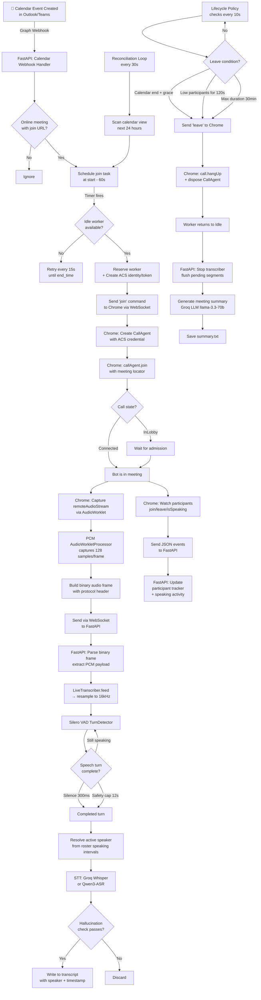
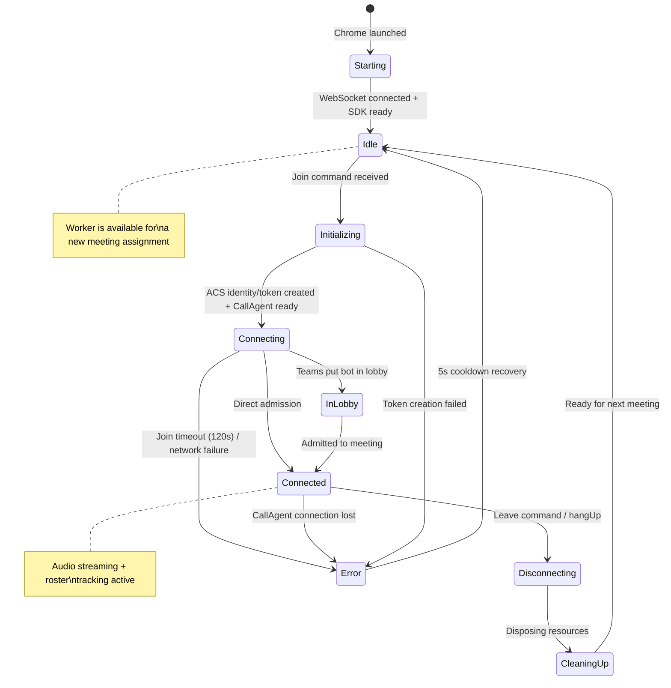
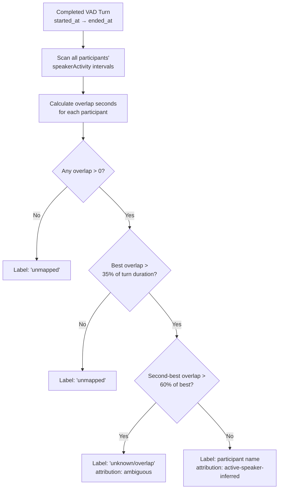

# Teams ACS POC — Complete Implementation Documentation

## Table of Contents
1. [Project Overview](#1-project-overview)
2. [Architecture Overview](#2-architecture-overview)
3. [System Flow Diagram](#3-system-flow-diagram)
4. [Detailed Component Breakdown](#4-detailed-component-breakdown)
5. [End-to-End Execution Flow](#5-end-to-end-execution-flow)
6. [Audio Protocol & Binary Frame Format](#6-audio-protocol--binary-frame-format)
7. [Voice Activity Detection (VAD)](#7-voice-activity-detection-vad)
8. [Speech-to-Text Pipeline](#8-speech-to-text-pipeline)
9. [Speaker Attribution (Active-Speaker Inference)](#9-speaker-attribution-active-speaker-inference)
10. [Meeting Summary Generation](#10-meeting-summary-generation)
11. [Calendar Automation](#11-calendar-automation)
12. [Meeting Lifecycle Policy](#12-meeting-lifecycle-policy)
13. [Data Storage & Output](#13-data-storage--output)
14. [Configuration & Environment](#14-configuration--environment)
15. [POC Infrastructure (Current)](#15-poc-infrastructure-current)
16. [Production Infrastructure & Implementation](#16-production-infrastructure--implementation)
17. [Comparison: ACS POC vs Internal Media SDK Bot](#17-comparison-acs-poc-vs-internal-media-sdk-bot)

---

## 1. Project Overview

The **Teams ACS POC** (Azure Communication Services Proof of Concept) is a bot that joins **external / cross-tenant** Microsoft Teams meetings as an anonymous ACS participant. Unlike the internal Meeting Assistant bot (which uses the Teams Media SDK and requires admin consent in the target tenant), this bot can join meetings across any organization without admin consent.

### Key Capabilities
- Joins Teams meetings via URL or meeting ID/passcode
- Works **cross-tenant** — no admin consent needed in the meeting host's organization
- Receives **mixed meeting audio** (single stream, all speakers combined)
- Transcribes in real-time using Groq Whisper or Qwen3-ASR
- **Infers** speaker identity from ACS roster's active-speaker events
- Generates structured meeting summaries (summary, action items, key decisions)
- Calendar-driven auto-join via Microsoft Graph subscriptions
- Supports concurrent meetings (one Chromium worker per meeting)
- Automatic leave policies (end time, low participants, max duration)

### How It Differs from the Internal Bot

| Aspect | Internal Bot (Meeting_Assistant) | ACS POC (this project) |
|--------|----------------------------------|------------------------|
| Audio type | Per-speaker **unmixed** | **Mixed** (all speakers in one stream) |
| Speaker attribution | Exact (from Media SDK slots) | **Inferred** (active-speaker heuristic) |
| Platform | Windows only (.NET Media SDK) | **Cross-platform** (Python + Chrome) |
| Tenant requirement | Admin consent in target tenant | **None** (anonymous ACS join) |
| Infrastructure | Static IP + TLS + TCP tunnel | **Standard HTTP only** |
| Diarization needed | No | Effectively yes (via roster inference) |

---

## 2. Architecture Overview

```
┌─────────────────────────────────────────────────────────────────────────────┐
│                        Microsoft Teams Cloud                                 │
│                                                                             │
│   ┌─────────────────┐    ┌──────────────────────┐    ┌─────────────────┐   │
│   │ Outlook Calendar │    │  Teams Meeting       │    │  Graph API      │   │
│   │     Events       │    │  (ACS interop audio) │    │                 │   │
│   └────────┬─────────┘    └──────────┬───────────┘    └────────┬────────┘   │
└────────────┼─────────────────────────┼─────────────────────────┼────────────┘
             │ HTTPS                   │ WebRTC                  │ HTTPS
             │ (Graph Webhooks)        │ (Mixed Audio)           │ (Auth)
             │                         │                         │
             ▼                         ▼                         │
┌──────────────────────────────────────────────────────────────────────────────┐
│                          LOCAL SYSTEM                                         │
│                                                                              │
│  ┌────────────────────────────────────────────────────────────────────────┐  │
│  │                    PYTHON BACKEND (FastAPI :8000)                       │  │
│  │                                                                        │  │
│  │  ┌──────────────────┐  ┌──────────────────┐  ┌─────────────────────┐  │  │
│  │  │ Calendar Webhooks │  │ Meeting Sessions  │  │ API Endpoints       │  │  │
│  │  │ + Reconciliation  │  │ + Worker Pool    │  │ /api/meetings       │  │  │
│  │  │ + Scheduling      │  │   Management     │  │ /health             │  │  │
│  │  └────────┬─────────┘  └────────┬─────────┘  └─────────────────────┘  │  │
│  │           │                      │                                     │  │
│  │           ▼                      ▼                                     │  │
│  │  ┌──────────────────────────────────────────────────────────────────┐  │  │
│  │  │             WebSocket Server (ws://localhost:8000/ws/worker/*)    │  │  │
│  │  │   ← Control commands (join/leave)    → Events + Binary audio     │  │  │
│  │  └──────────────────────────────┬───────────────────────────────────┘  │  │
│  │                                 │                                      │  │
│  │                                 │ Binary PCM frames                    │  │
│  │                                 ▼                                      │  │
│  │  ┌──────────────────┐  ┌────────────────┐  ┌───────────────────────┐  │  │
│  │  │ STT Pipeline      │  │ Silero VAD     │  │ Meeting Summary       │  │  │
│  │  │ (LiveTranscriber) │◄─│ (TurnDetector) │  │ (on disconnect)       │  │  │
│  │  └────────┬─────────┘  └────────────────┘  └───────────────────────┘  │  │
│  │           │                                                            │  │
│  │           ▼                                                            │  │
│  │  ┌──────────────────┐                      ┌───────────────────────┐  │  │
│  │  │ Groq Whisper API  │  (or alternatively)  │ Qwen3-ASR Remote GPU │  │  │
│  │  │ (whisper-large-v3)│                      │ (vLLM + ngrok)       │  │  │
│  │  └──────────────────┘                      └───────────────────────┘  │  │
│  └────────────────────────────────────────────────────────────────────────┘  │
│                                                                              │
│  ┌────────────────────────────────────────────────────────────────────────┐  │
│  │              CHROMIUM WORKER POOL (1 worker per meeting)                │  │
│  │                                                                        │  │
│  │  ┌─────────────────────────────────────────────────────────────────┐   │  │
│  │  │  Worker 1 (Chrome)                                              │   │  │
│  │  │  ┌──────────────────────────────────────────────────────────┐   │   │  │
│  │  │  │  ACS Web Calling SDK (JavaScript)                        │   │   │  │
│  │  │  │  - CallClient → CallAgent → Call                         │   │   │  │
│  │  │  │  - AudioWorklet (PCM capture @ 16kHz)                    │   │   │  │
│  │  │  │  - Roster tracking (join/leave/isSpeaking)               │   │   │  │
│  │  │  │  - WebSocket client → FastAPI                            │   │   │  │
│  │  │  └──────────────────────────────────────────────────────────┘   │   │  │
│  │  └─────────────────────────────────────────────────────────────────┘   │  │
│  │                                                                        │  │
│  │  ┌─────────────────────────────────────────────────────────────────┐   │  │
│  │  │  Worker 2 (Chrome) — same structure                             │   │  │
│  │  └─────────────────────────────────────────────────────────────────┘   │  │
│  └────────────────────────────────────────────────────────────────────────┘  │
└──────────────────────────────────────────────────────────────────────────────┘
```

---

## 3. System Flow Diagram

### Complete End-to-End Flow (Mermaid)



### Worker State Machine



---

## 4. Detailed Component Breakdown

### 4.1 Python Backend (`main.py` + supporting modules)

| File | Responsibility |
|------|---------------|
| `main.py` | FastAPI app: API endpoints, WebSocket server, meeting sessions, calendar scheduling, audio parsing, worker pool, lifecycle policy |
| `graph_calendar.py` | Microsoft Graph authentication, calendar event fetching, subscription CRUD |
| `worker_pool_manager.py` | Launches N Chrome processes (one per configured worker) |
| `worker_manager.py` | Supervises a single Chrome process (launches, metrics, restart) |
| `stt_pipeline.py` | `LiveTranscriber` class: resampling, VAD integration, STT dispatch, transcript writing |
| `vad.py` | Silero VAD `TurnDetector`: speech/silence detection for the mixed stream |
| `groq_stt_client.py` | Groq Whisper transcription with hallucination filtering |
| `qwen_remote_stt_client.py` | Qwen3-ASR via remote vLLM + ngrok |
| `meeting_summary.py` | Post-meeting LLM summary generation |
| `ngrok_manager.py` | Standalone ngrok tunnel manager (alternative to in-process tunnel) |

### 4.2 Chromium ACS Worker (`acs-worker/`)

| File | Responsibility |
|------|---------------|
| `src/worker.js` | ACS Web Calling SDK integration: join/leave, audio capture, roster tracking, WebSocket communication |
| `src/pcm-worklet.js` | AudioWorklet processor: captures PCM S16LE from WebRTC audio |
| `index.html` | Minimal HTML host page for the worker JavaScript |
| `Dockerfile` | Container image for headless Chrome deployment |
| `vite.config.js` | Build configuration (bundles worker.js for production) |

### 4.3 Key Data Structures

**MeetingSession** (Python, in-memory):
```python
@dataclass
class MeetingSession:
    id: uuid.UUID                    # Unique session identifier
    locator: dict[str, str]          # Meeting URL or ID/passcode
    display_name: str                # Bot's display name in meeting
    identity: str                    # ACS user identity
    token: str                       # ACS VoIP token
    worker_id: str                   # Assigned Chrome worker
    state: str                       # Current lifecycle state
    events: list[dict]               # Event log (last 1000)
    audio_bytes: int                 # Total audio received
    audio_frames: int                # Total audio frames
    transcriber: LiveTranscriber     # STT pipeline instance
    participants: dict               # Roster with speaking activity
    scheduled_end: datetime          # Calendar event end time
    ever_connected: bool             # Has the meeting been fully connected
```

**PersistentWorker** (Python, in-memory):
```python
@dataclass
class PersistentWorker:
    websocket: WebSocket | None      # Active WebSocket to Chrome
    state: str                       # Starting/Idle/Initializing/Connected/...
    active_session_id: uuid.UUID     # Currently assigned meeting
    last_error: dict | None          # Most recent error info
```

---

## 5. End-to-End Execution Flow

### Phase 1: Startup Sequence

```
Terminal 1: uv run uvicorn main:app --host 127.0.0.1 --port 8000
  └─ FastAPI starts
  └─ If GRAPH_* env vars set:
     └─ Start ngrok HTTPS tunnel (in-process) for webhook
     └─ Create/restore Graph calendar subscription
     └─ Start notification consumer task
     └─ Start calendar reconciliation loop (every 30s)
  └─ Static file mount: /worker/ → acs-worker/dist/

Terminal 2: uv run python worker_pool_manager.py
  └─ For each worker (1..ACS_WORKER_COUNT):
     └─ Request launch URL from FastAPI (POST /api/worker/launch)
     └─ Launch Chrome with the launch URL
     └─ Chrome loads /worker/?worker=worker-N#<bootstrap-token>
     └─ Worker.js:
        ├─ POST /api/worker/{id}/bootstrap (exchange bootstrap → WS ticket)
        ├─ Connect WebSocket to ws://127.0.0.1:8000/ws/worker/{id}
        ├─ Initialize CallClient
        └─ Transition to "Idle" — ready for meetings
```

### Phase 2: Meeting Join (Manual or Calendar-Triggered)

```
1. Trigger: Either manual POST /api/meetings or calendar scheduler fires
2. FastAPI:
   a. Acquire worker_reservation_lock
   b. Find first idle worker with no active session
   c. Reserve worker (set active_session_id, state=Initializing)
   d. Release lock
   e. Create ACS identity + VoIP token (async, with timeout)
   f. Create MeetingSession + LiveTranscriber
   g. Send "join" command to Chrome worker via WebSocket:
      { type: "command", action: "join", sessionId, locator, identity, token, displayName }
   h. Start lifecycle policy enforcer task

3. Chrome Worker:
   a. Create AzureCommunicationTokenCredential from token
   b. Create CallAgent with displayName
   c. Wait for CallAgent connection (up to 30s)
   d. callAgent.join(locator, { audioOptions: { muted: true } })
   e. Start 120s join timeout
   f. Subscribe to call state changes
   g. Subscribe to remoteParticipantsUpdated
   h. When Connected:
      - Clear join timeout
      - Ensure bot is muted (receive-only)
      - Capture all remoteAudioStreams
```

### Phase 3: Real-Time Audio Capture & Processing

```
Every ~2.67ms (128 samples at 48kHz, or 128 at 16kHz):

1. Chrome AudioWorklet (pcm-worklet.js):
   a. Receives 128 float32 samples from WebRTC decoded audio
   b. Downmixes channels, converts to Int16
   c. Posts PCM buffer to main thread via MessagePort

2. Chrome worker.js:
   a. Receives PCM buffer from worklet
   b. Builds binary frame with protocol header:
      [1B version][16B session UUID][16B stream UUID][2B participant_len]
      [4B sequence][8B timestamp_us][4B payload_len][N participant][M audio]
   c. Sends binary frame via WebSocket (if bufferedAmount < 2MB)

3. FastAPI WebSocket handler:
   a. Receives binary message
   b. parse_audio_message() validates header, extracts payload
   c. Verifies session_id matches active worker session
   d. Checks monotonic sequence number
   e. Calls session.transcriber.feed(payload)

4. LiveTranscriber._run() async loop:
   a. Receives PCM bytes from queue
   b. Converts int16 → float32 normalized
   c. Resamples to 16kHz if source rate differs
   d. Feeds to TurnDetector (Silero VAD)

5. TurnDetector processes in 512-sample (32ms) windows:
   a. Speech start detected → begin buffering
   b. Turn ends on:
      - 300ms silence (VAD probability < threshold)
      - 12s safety cap (prevents runaway buffers)
   c. Returns CompletedTurn(audio, started_at, ended_at)

6. Completed turn → async _finalize():
   a. Resolve speaker from roster activity (active-speaker inference)
   b. Send audio to Groq Whisper API
   c. Hallucination check (no_speech_prob, avg_logprob)
   d. If passes: write to transcript file
```

### Phase 4: Roster Tracking & Speaker Events

```
While Connected:

1. Chrome detects participant events:
   - "remoteParticipantsUpdated" → added/removed participants
   - participant.on("isSpeakingChanged") → speaking start/stop
   - participant.on("stateChanged") → Disconnected = left

2. For each event, Chrome sends JSON to FastAPI:
   { type: "participant_joined", participantId, displayName, at }
   { type: "participant_speaking", participantId, isSpeaking, at }
   { type: "participant_left", participantId, at }

3. FastAPI _record_event() updates session.participants:
   - Tracks presence intervals: [{joinedAt, leftAt}]
   - Tracks speaker activity: [{startedAt, endedAt}]
   - Used later for active-speaker attribution
```

### Phase 5: Meeting End & Summary

```
1. Leave triggers (from _enforce_meeting_policy):
   - Calendar end + MEETING_LEAVE_GRACE_SECONDS (60s)
   - Low participants (< MIN_HUMAN_PARTICIPANTS) for LOW_PARTICIPANT_GRACE_SECONDS (120s)
   - MAX_MEETING_DURATION_SECONDS (1800s = 30 min)
   - Manual leave command
   - Calendar event deleted

2. FastAPI sends leave command to Chrome:
   { type: "command", action: "leave", sessionId, reason }

3. Chrome cleanupMeeting():
   a. Stop audio captures (disconnect AudioWorklet)
   b. call.hangUp()
   c. callAgent.dispose()
   d. credential.dispose()
   e. audioContext.close()
   f. Send "disconnected" event to FastAPI
   g. Transition to Idle (ready for next meeting)

4. FastAPI handles disconnect:
   a. session.scrub() — clear sensitive fields (token, locator)
   b. _finalize_transcription(session):
      - Stop LiveTranscriber (flushes pending VAD buffer)
      - generate_meeting_summary(session_id, subject)
   c. Write final meeting.json metadata

5. Summary generation:
   a. Read transcript file
   b. Extract unique speakers
   c. Call Groq LLM (llama-3.3-70b-versatile)
   d. Save to transcripts/{session_id}/summary.txt
```

---

## 6. Audio Protocol & Binary Frame Format

### WebSocket Connection
- URL: `ws://127.0.0.1:8000/ws/worker/{worker_id}?ticket={ticket}`
- Direction: Bidirectional
  - FastAPI → Chrome: JSON commands (join, leave)
  - Chrome → FastAPI: JSON events + Binary audio frames
- Authentication: One-time ticket (hash-verified, 2-minute expiry)

### Binary Audio Frame Format

```
┌──────────────────────────────────────────────────────────────────────────┐
│ Offset │ Size    │ Type      │ Field                                     │
├────────┼─────────┼───────────┼───────────────────────────────────────────┤
│ 0      │ 1 byte  │ uint8     │ Protocol version (always 1)               │
│ 1      │ 16 bytes│ UUID bytes│ Session ID                                │
│ 17     │ 16 bytes│ UUID bytes│ Stream ID (unique per audio capture)       │
│ 33     │ 2 bytes │ uint16 BE │ Participant ID length (N)                 │
│ 35     │ 4 bytes │ uint32 BE │ Sequence number (monotonic per stream)    │
│ 39     │ 8 bytes │ uint64 BE │ Timestamp (microseconds since epoch)      │
│ 47     │ 4 bytes │ uint32 BE │ Payload length (M)                        │
│ 51     │ N bytes │ UTF-8     │ Participant ID (currently empty)           │
│ 51+N   │ M bytes │ PCM S16LE │ Audio payload (16-bit signed, mono)       │
└──────────────────────────────────────────────────────────────────────────┘

Header size: 51 bytes (fixed) + N (participant) + M (audio)
Max payload: 256 KB
```

### Audio Characteristics
- Format: PCM S16LE (16-bit signed integer, little-endian)
- Channels: Mono (downmixed from all channels)
- Sample rate: Depends on browser AudioContext (requested 16kHz, may get 48kHz)
- Frame size: 128 samples per AudioWorklet process() call
- Resampling: Python resamples to 16kHz if needed (linear interpolation)

---

## 7. Voice Activity Detection (VAD)

### Technology: Silero VAD (`vad.py`)

Same neural network model as the internal bot, but operating on a **single mixed stream** instead of per-speaker-slot buffers.

### Key Difference from Internal Bot

| Aspect | Internal Bot (simple_vad.py) | ACS POC (vad.py) |
|--------|------------------------------|-------------------|
| Instances | One per ActiveSpeakerId slot | **One per meeting** |
| Audio type | Per-speaker unmixed | Mixed (all speakers) |
| Identity-change split | Yes (slot reassignment) | **Not applicable** |
| Speaker attribution | From slot identity | **Post-hoc roster inference** |

### Turn Boundary Detection

A speech turn ends when either condition fires:

| Signal | Default Threshold | Notes |
|--------|-------------------|-------|
| **Silence detected** | 300ms below VAD_THRESHOLD (0.65) | Primary turn-end signal |
| **Safety duration cap** | 12 seconds | Backstop only (prevents runaway buffers) |

### Configuration (via env vars)

| Env Var | Default | Purpose |
|---------|---------|---------|
| `VAD_THRESHOLD` | 0.65 | Speech confidence threshold |
| `VAD_MIN_SILENCE_MS` | 300 | Silence duration to end a turn |
| `VAD_SPEECH_PAD_MS` | 100 | Padding around speech |
| `VAD_MIN_SEGMENT_MS` | 700 | Discard segments shorter than this |
| `VAD_MAX_SEGMENT_SECONDS` | 12 | Safety cap (seconds) |

### Output

Each completed turn produces a `CompletedTurn`:
```python
class CompletedTurn(NamedTuple):
    audio: np.ndarray      # float32 16kHz mono
    started_at: datetime   # wall-clock estimate of speech start
    ended_at: datetime     # wall-clock estimate of speech end
```

The `started_at` / `ended_at` timestamps are used for speaker attribution against the ACS roster.

---

## 8. Speech-to-Text Pipeline

### Provider Selection (via `STT_PROVIDER` env var)

| Provider | Model | Latency | Notes |
|----------|-------|---------|-------|
| `groq` (default) | Whisper Large V3 | ~2-5s | Cloud API, hallucination filtering |
| `qwen_remote` | Qwen3-ASR 1.7B | ~3-5s | Remote GPU via vLLM + ngrok |

### Anti-Hallucination Pipeline (Groq)

Same multi-layer approach as the internal bot:

1. **RMS energy pre-filter**: Skip if `rms < 0.005`
2. **Known phrases**: Reject "you", "Thank you.", "Bye.", etc.
3. **verbose_json confidence check**:
   - Reject if `no_speech_prob > 0.6`
   - Reject if `avg_logprob < -1.0`
4. **Unverifiable segments**: Reject if `segments` field is missing

### Concurrency
- Semaphore(3): Max 3 concurrent STT API calls
- Async tasks: Transcription runs in background, never blocks audio queue
- Queue overflow: Drops frames (tracked as `dropped_chunks`) if processing can't keep up

---

## 9. Speaker Attribution (Active-Speaker Inference)

Since ACS provides **mixed audio** (not per-speaker), speaker identification uses a **heuristic inference** system based on the ACS roster's `isSpeakingChanged` events.

### How It Works



### Algorithm (`_resolve_active_speaker`)

```python
def _resolve_active_speaker(session, start, end):
    # For each participant, calculate how many seconds they were
    # speaking during [start, end)
    scores = [(overlap_seconds, display_name) for each participant]
    
    # No one speaking? → unmapped
    if not scores: return "unmapped"
    
    # Best candidate's overlap < 35% of turn? → not confident enough
    if best_overlap < duration * 0.35: return "unmapped"
    
    # Second candidate overlaps significantly? → ambiguous
    if second_best >= best * 0.60: return "unknown/overlap"
    
    # Clear winner
    return best_candidate_name
```

### Attribution Labels in Transcript

| Label | Meaning |
|-------|---------|
| `[active-speaker-inferred]` | Confident single-speaker match |
| `[active-speaker-ambiguous]` | Multiple speakers overlapping, can't determine |
| `[unmapped]` | No roster speaking activity matched the turn |

---

## 10. Meeting Summary Generation

Identical approach to the internal bot, triggered when a session disconnects:

### Trigger Conditions
- Worker reports "Disconnected" (normal leave)
- Worker reports "Error" (connection lost)
- Worker WebSocket closes unexpectedly

### Process
1. Stop `LiveTranscriber` (flushes any pending VAD buffer as a final turn)
2. Read transcript file `transcripts/{session_id}.txt`
3. Extract unique speakers (excluding "unmapped" and "unknown/overlap")
4. Build prompt with transcript text
5. Call Groq LLM (`llama-3.3-70b-versatile`, temperature=0.3, max_tokens=2000)
6. Save to `transcripts/{session_id}/summary.txt`

---

## 11. Calendar Automation

### Automatic Startup Flow

When `GRAPH_TENANT_ID`, `GRAPH_CLIENT_ID`, `GRAPH_CLIENT_SECRET`, and `GRAPH_MAILBOX_ADDRESS` are all configured:

```
FastAPI startup
  ├─ _ensure_webhook_tunnel()
  │   └─ pyngrok: connect ngrok HTTPS tunnel on port 8000
  │
  ├─ _bootstrap_graph_subscription()
  │   ├─ Check graph-subscription.json (saved state)
  │   ├─ If valid: restore + start renewal task
  │   └─ If expired/missing: create new subscription + save
  │
  ├─ _graph_notification_consumer() (async task)
  │   └─ Processes calendar webhook notifications from queue
  │
  └─ _calendar_reconciliation_loop() (async task, every 30s)
      └─ Polls calendarView to catch missed notifications
```

### Event Scheduling Logic

```
1. Calendar event received (webhook or reconciliation)
2. Validate: isOnlineMeeting=true, has joinUrl, not cancelled
3. Calculate join_at = start - MEETING_JOIN_EARLY_SECONDS (60s)
4. Create async task that:
   a. Sleeps until join_at
   b. Calls create_meeting() to join via an idle worker
   c. On capacity failure (409/502/503): retry every 15s until end_time
5. One event → one session (deduplication via calendar_sessions map)
6. Event deleted → cancel pending task, leave active session
```

### Subscription Lifecycle
- Auto-created on startup
- Saved to `graph-subscription.json`
- Auto-renewed 1 hour before expiry
- Webhook validation handled (`validationToken` response)
- Client state HMAC-verified on incoming notifications

---

## 12. Meeting Lifecycle Policy

The `_enforce_meeting_policy` task runs every 10 seconds for each active session:

| Condition | Threshold | Action |
|-----------|-----------|--------|
| Max duration | `MAX_MEETING_DURATION_SECONDS` (1800s = 30min) | Leave |
| Calendar end | `scheduled_end + MEETING_LEAVE_GRACE_SECONDS` (60s) | Leave |
| Low participants | `< MIN_HUMAN_PARTICIPANTS` (2) for `LOW_PARTICIPANT_GRACE_SECONDS` (120s) | Leave |

### Low-Participant Logic
- The minimum must be reached **at least once** before the timer starts
- Prevents the bot from leaving while waiting for the second person to join
- Once reached, if count drops below minimum for 120s straight → leave

---

## 13. Data Storage & Output

### File Structure

```
transcripts/
├── {session-id-1}.txt                    # Real-time transcript
├── {session-id-1}/
│   ├── meeting.json                      # Session metadata + roster + state
│   ├── participants.json                 # Participant details
│   └── summary.txt                       # LLM-generated summary
├── {session-id-2}.txt
├── {session-id-2}/
│   ├── meeting.json
│   ├── participants.json
│   └── summary.txt
└── ...
```

### Transcript Format
```
[09:59:32.145] [active-speaker-inferred] Jane Smith: Good morning everyone.
[09:59:38.672] [active-speaker-inferred] Bob Johnson: Morning, I have updates.
[10:00:15.301] [unmapped] unmapped: Can we start with the API changes?
[10:01:02.888] [active-speaker-ambiguous] unknown/overlap: Yeah sure, go ahead.
```

### meeting.json Schema
```json
{
  "sessionId": "uuid",
  "calendarEventId": "graph-event-id",
  "subject": "Weekly Standup",
  "state": "Disconnected",
  "workerId": "worker-1",
  "createdAt": "2026-08-13T09:58:00Z",
  "scheduledEnd": "2026-08-13T10:30:00Z",
  "audioFrames": 45000,
  "audioBytes": 5760000,
  "transcriptAttribution": "active-speaker-inferred-when-unambiguous",
  "scheduledAttendees": [
    {"name": "Jane Smith", "email": "jane@company.com", "type": "required"}
  ],
  "participants": {
    "acs-id-123": {
      "participantId": "acs-id-123",
      "displayName": "Jane Smith",
      "joinCount": 1,
      "present": false,
      "presence": [{"joinedAt": "...", "leftAt": "..."}],
      "speaking": false,
      "speakerActivity": [{"startedAt": "...", "endedAt": "..."}]
    }
  }
}
```

---

## 14. Configuration & Environment

### Key Timings & Intervals

| Component | Value | Source |
|-----------|-------|--------|
| AudioWorklet frame | 128 samples (~2.7ms @48kHz or 8ms @16kHz) | Chrome |
| VAD window | 512 samples (32ms @16kHz) | Silero |
| VAD silence threshold | 300ms | `VAD_MIN_SILENCE_MS` |
| Calendar reconciliation | 30s | `GRAPH_RECONCILE_SECONDS` |
| Join early buffer | 60s before start | `MEETING_JOIN_EARLY_SECONDS` |
| Leave grace | 60s after end | `MEETING_LEAVE_GRACE_SECONDS` |
| Low-participant grace | 120s | `LOW_PARTICIPANT_GRACE_SECONDS` |
| Max meeting duration | 1800s (30 min) | `MAX_MEETING_DURATION_SECONDS` |
| Join timeout | 120s | Hardcoded in worker.js |
| CallAgent connection timeout | 30s | Hardcoded in worker.js |
| Policy check interval | 10s | Hardcoded in main.py |
| Worker error recovery | 5s cooldown | Hardcoded in worker.js |
| Subscription renewal | 1 hour before expiry | Hardcoded in main.py |

### Required Services & Credentials

| Service | Purpose | Required? |
|---------|---------|-----------|
| Azure Communication Services | ACS identity/token, Teams interop | **Yes** |
| Google Chrome / Chromium | Browser for ACS Web Calling SDK | **Yes** |
| Groq API | STT (Whisper) + LLM (summary) | Optional (STT disabled without it) |
| Microsoft Graph | Calendar automation | Optional (manual join still works) |
| ngrok | HTTPS tunnel for Graph webhooks | Optional (only for calendar) |

---

## 15. POC Infrastructure (Current)

```
┌──────────────────────────────────────────────────────────────────────┐
│                LOCAL MACHINE (Linux or Windows)                        │
│                                                                      │
│  ┌────────────────┐  ┌──────────────────────────────────────────┐   │
│  │ Python Backend  │  │ Chrome Worker Pool                        │   │
│  │ (FastAPI :8000) │  │ (N Chrome instances, one per worker)     │   │
│  │                 │◄─│                                          │   │
│  │ - Calendar sync │──►│ Worker 1: ACS Calling SDK               │   │
│  │ - WebSocket srv │  │ Worker 2: ACS Calling SDK               │   │
│  │ - Audio/VAD/STT │  │                                          │   │
│  │ - Summary gen   │  └──────────────────────────────────────────┘   │
│  └────────────────┘                                                  │
│                                                                      │
│  Storage: Local filesystem (transcripts/ folder)                     │
│  STT: Groq Cloud API (external)                                      │
│  LLM: Groq Cloud API (external)                                      │
│  Tunnel: ngrok (for Graph webhooks only)                             │
└──────────────────────────────────────────────────────────────────────┘
         │
         │ HTTPS (ngrok for webhooks) + WebRTC (ACS for audio)
         ▼
┌──────────────────────────────────────────────────────────────────────┐
│     Microsoft Teams Cloud + Azure Communication Services              │
└──────────────────────────────────────────────────────────────────────┘
```

### POC Advantages Over Internal Bot
- **No Windows requirement** — runs on Linux/macOS/Windows
- **No static IP, TLS certificate, or TCP tunnel** needed
- **No admin consent** in the meeting host's tenant
- **Standard HTTP/WebRTC** — no Media SDK constraints
- **Containerizable** — Chrome runs in Docker (see Dockerfile)

### POC Limitations
- Mixed audio only (no per-speaker separation)
- Speaker attribution is heuristic (not exact)
- Chrome is resource-heavy (~200-400MB RAM per worker)
- ACS WebJS SDK origin validation complexities
- Lobby admission may be required (depends on meeting policy)
- No official headless Chrome support from ACS SDK

---

## 16. Production Infrastructure & Implementation

### Production Architecture (AWS)

```
┌─────────────────────────────────────────────────────────────────────────────┐
│                          AWS CLOUD INFRASTRUCTURE                             │
│                                                                             │
│  ┌─────────────────────────────────────────────────────────────────────┐    │
│  │                    Amazon ECS (Fargate)                               │    │
│  │                                                                     │    │
│  │  ┌────────────────────────────────────┐                             │    │
│  │  │ Task: Python Backend (FastAPI)      │                             │    │
│  │  │ - ECR image (Linux container)       │                             │    │
│  │  │ - ALB (HTTPS, public-facing)        │                             │    │
│  │  │ - Graph webhooks direct to ALB      │                             │    │
│  │  │ - No ngrok needed                   │                             │    │
│  │  └───────────────┬────────────────────┘                             │    │
│  │                  │ WebSocket (internal)                              │    │
│  │                  ▼                                                   │    │
│  │  ┌────────────────────────────────────┐                             │    │
│  │  │ Task: Chrome Workers (x N)          │                             │    │
│  │  │ - ECR image (Chrome + ACS SDK)      │                             │    │
│  │  │ - One task per concurrent meeting   │                             │    │
│  │  │ - Auto-scaling based on demand      │                             │    │
│  │  └────────────────────────────────────┘                             │    │
│  │                                                                     │    │
│  └─────────────────────────────────────────────────────────────────────┘    │
│                                                                             │
│  ┌─────────────────┐  ┌──────────────────┐  ┌────────────────────────┐     │
│  │ Amazon RDS       │  │ AWS Secrets      │  │ Amazon CloudWatch      │     │
│  │ (PostgreSQL)     │  │ Manager          │  │ + X-Ray                │     │
│  │ - Sessions       │  │ - ACS keys       │  │ - Logs                 │     │
│  │ - Transcripts    │  │ - Graph creds    │  │ - Metrics              │     │
│  │ - Summaries      │  │ - Groq API key   │  │ - Alerts               │     │
│  └─────────────────┘  └──────────────────┘  └────────────────────────┘     │
│                                                                             │
│  ┌─────────────────┐  ┌──────────────────┐                                 │
│  │ Amazon ECR       │  │ Amazon S3        │                                 │
│  │ - FastAPI image  │  │ - Audio archives │                                 │
│  │ - Chrome image   │  │ - Transcript     │                                 │
│  │                  │  │   backups        │                                 │
│  └─────────────────┘  └──────────────────┘                                 │
└─────────────────────────────────────────────────────────────────────────────┘
```

### Why Fargate Works Here (Unlike the Internal Bot)

| Requirement | ACS POC | Internal Bot |
|-------------|---------|--------------|
| OS | Linux ✅ | Windows ❌ (Fargate doesn't support) |
| Static IP | Not needed ✅ | Required ❌ |
| TLS cert binding | Not needed ✅ | Required ❌ |
| Raw TCP inbound | Not needed ✅ | Required ❌ |
| Audio delivery | WebRTC (outbound) ✅ | Inbound TCP ❌ |

**The ACS POC is a perfect fit for Fargate** because it only needs standard outbound HTTPS/WebRTC connections — no special network configuration.

### Key Production Changes

| Aspect | POC (Current) | Production (AWS) |
|--------|---------------|------------------|
| Python hosting | Local uvicorn | **ECS Fargate** (Linux container behind ALB) |
| Chrome workers | Local Chrome processes | **ECS Fargate tasks** (Chrome in Docker) |
| Storage | Local filesystem | **Amazon RDS** (PostgreSQL) + **S3** for archives |
| Secrets | `.env` file | **AWS Secrets Manager** |
| Webhook URL | ngrok tunnel | **ALB public URL** (stable, no tunnel) |
| Monitoring | Console logs | **CloudWatch** + **X-Ray** |
| Scaling | Fixed worker count | **ECS auto-scaling** (scale workers with demand) |
| Container registry | N/A | **Amazon ECR** |
| Network | Local loopback | **VPC + private subnets** |

### Chrome Worker Containerization

The `acs-worker/Dockerfile` already provides the template for containerizing Chrome:

```dockerfile
# Base: Chrome + Node.js + audio libraries
FROM node:20-bookworm
RUN apt-get install -y chromium xvfb pulseaudio ...
COPY acs-worker/ /app/
COPY worker_manager.py /app/
# Entrypoint launches Xvfb + Chrome with the worker page
```

### Services NOT Used

- **Azure Communication Services (ACS)** — **IS used** (this is the core of this POC)
- **Teams Media SDK / .NET** — Not used (that's the internal bot's approach)
- **SageMaker** — Not used (STT/LLM are via Groq cloud API, not self-hosted models)
- **EC2 Windows instances** — Not needed (no Windows dependency)

---

## 17. Comparison: ACS POC vs Internal Media SDK Bot

| Feature | Internal Bot (Meeting_Assistant) | ACS POC (teams-acs-poc) |
|---------|----------------------------------|-------------------------|
| **Join method** | Graph Calls API + Media SDK | ACS Web Calling SDK |
| **Audio** | Per-speaker unmixed (TCP) | Mixed stream (WebRTC) |
| **Speaker ID** | Exact (from audio slot) | Inferred (roster heuristic) |
| **Platform** | Windows only | Cross-platform (Linux preferred) |
| **Admin consent** | Required in target tenant | Not required |
| **Infrastructure** | Static IP + TLS + TCP tunnel | Standard HTTPS only |
| **Network** | .NET ↔ Python WebSocket (local) | Chrome ↔ Python WebSocket |
| **Containerizable** | No (Media SDK constraint) | Yes (Fargate-ready) |
| **Concurrent meetings** | One per process | N per worker pool |
| **Calendar integration** | Graph webhooks + APScheduler | Graph webhooks + async tasks |
| **STT providers** | Groq/NVIDIA/Qwen (4 options) | Groq/Qwen remote (2 options) |
| **VAD** | Per-speaker Silero + identity-split | Single mixed-stream Silero |
| **Summary** | Same (Groq LLM) | Same (Groq LLM) |
| **Use case** | Internal/same-tenant meetings | External/cross-tenant meetings |

### When to Use Which

- **Internal Bot**: When you control the tenant, need exact speaker attribution, and have admin consent
- **ACS POC**: When joining external meetings, cross-tenant, or when you can't get admin consent

---

## Summary

The Teams ACS POC demonstrates a fully containerizable, cross-platform approach to joining Microsoft Teams meetings externally. It trades the internal bot's exact per-speaker audio attribution for the ability to join any Teams meeting without admin consent. The architecture (Python + Chrome browser workers) is well-suited for cloud deployment on services like AWS ECS Fargate, with the main trade-off being that speaker attribution is inferential rather than exact. The production path primarily involves containerizing the existing architecture, adding a proper database, and replacing ngrok with a stable public endpoint behind a load balancer.
