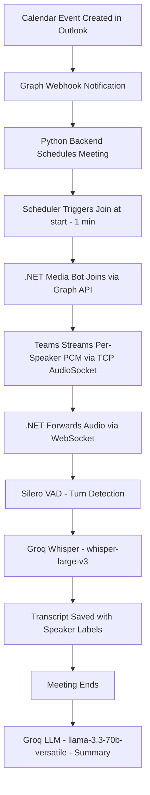
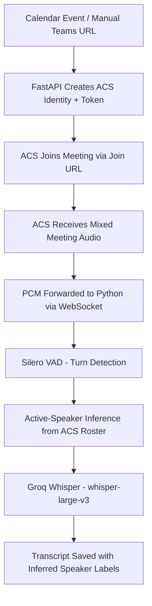

# Meeting Bot — High-Level Flows

## 1. Internal Meeting Join (Meeting_Assistant)

Uses the **Teams Media SDK (.NET)** to join as a first-party bot with per-speaker unmixed audio access.

**Key characteristics:**
- Per-speaker unmixed audio (no diarization needed)
- Requires Azure VM with static public IP + TLS certificate for TCP media
- Bot appears as a named participant in the meeting
- Real-time transcription with speaker identification

---

## 2. External Meeting Join (teams-acs-poc)

Uses **Azure Communication Services (ACS) Web Calling SDK** in a Chromium worker to join as an anonymous ACS participant.

**Key characteristics:**
- Mixed audio (single stream, speaker attribution via active-speaker inference)
- No TCP port / TLS certificate required (WebSocket-based audio delivery)
- Works for external/cross-tenant meetings without admin consent in the other tenant
- One Chromium worker per concurrent meeting

---

## Models Used

| Purpose | Model | Provider |
|---------|-------|----------|
| Speech-to-Text | `whisper-large-v3` | Groq |
| Meeting Summary | `llama-3.3-70b-versatile` | Groq |
